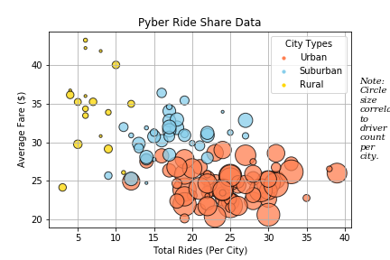
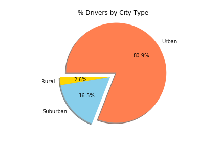
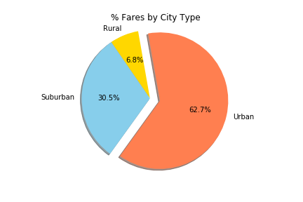
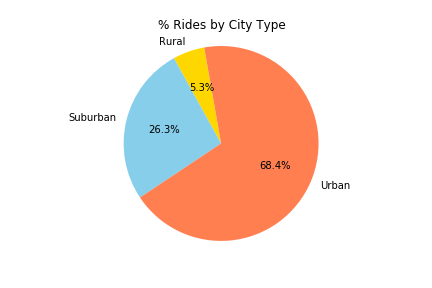

# MatPlotLib-Challenge_Pyber-Rideshare

Frist ride share data was imported into Jupyter Notebook and python coding used to create a dataframe containing all summary data.  From there I utilized MatPlotLib to create pie charts and bubble charts for Rideshare data within Jupyter Notebook.  

